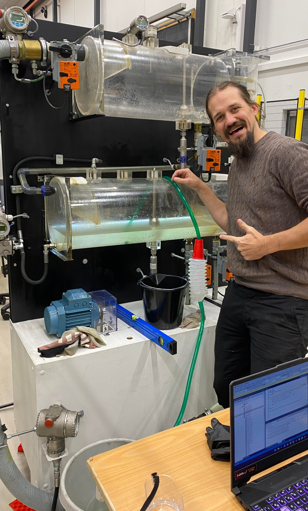
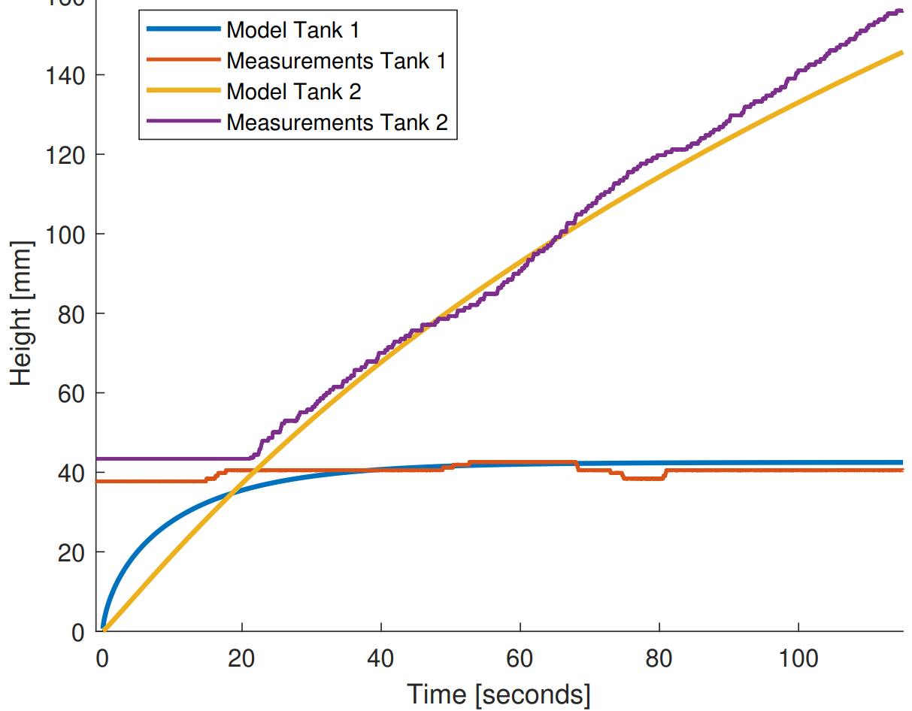
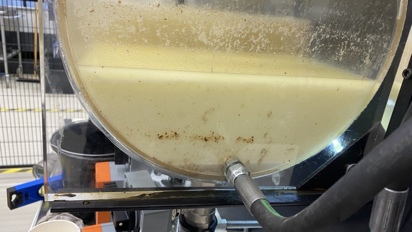

## MAS247 Project: Oil Separator System

*Project for the BSc. course MAS247 Industrial IT*
 \

## Overview

This project is based on the three-phase separator which 
separates oil from a water mixture through the use of gravity 
and valve control. Goals of the project:

- PLC programming with TwinCAT (with slight focus on OOP)
- Maximise the separation of oil form water mixture with feedback control
- Predict values using mathematical model with differential equations

The report and demo video is also added in the current working directory
